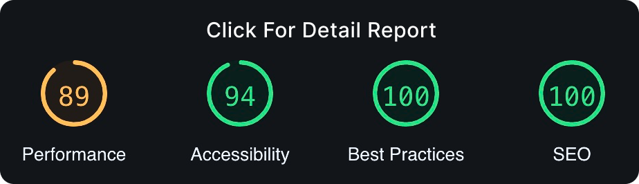

<a href="https://moshify-by-akash.netlify.app">
  <h1 align="center">Moshify</h1>
</a>
<p align="center">
  Check out the clean code, user-friendly features, and responsive design. <br>
  Join me on the journey of seamless web development! 
</p>

<a href="https://lighthouse-metrics.com/lighthouse/checks/165d2ed0-3341-4059-b2e0-5eb0cea78318/runs/65e59017-1d37-4120-862d-3ce4d398ef0b">
   <p align=center>
    
  <p>
</a>

<div align= "center">

[](https://twitter.com/yntpdotme) &nbsp; [](https://www.linkedin.com/in/yntpdotme/) &nbsp; [](mailto:akashkadlag14@gmail.com) &nbsp; [](https://conventionalcommits.org)&nbsp; [](https://choosealicense.com/licenses/mit/)

</div>

<h2 align="center">

[🚀&nbsp; Explore Demo](https://moshify-by-akash.netlify.app) &nbsp;&nbsp;&nbsp;&nbsp;&nbsp; [📂&nbsp; Source Code](https://github.com/yntpdotme/moshify)

</h2>
<br>

<p align="center">
  <a href="#introduction"><strong>Introduction</strong></a> 
	·&nbsp;<a href="#features"><strong>Features</strong></a> 
	·&nbsp;<a href="#tech-stack"><strong>Tech Stack</strong></a>
	·&nbsp;<a href="#local-development"><strong>Development Setup</strong></a> 
</p>
<br>

## <a name="introduction">❄️&nbsp; Introduction</a>

Moshify is an imaginary cloud hosting company, aiming to teach people how to build modern websites using HTML5 and CSS3. To learn how to build this website from scratch, you can check out **The Ultimate HTML and CSS course** on [**codewithmosh.com**](https://codewithmosh.com/p/the-ultimate-html-css).

<a href="https://moshify-by-akash.netlify.app">
   <p align=center>
    
  <p>
</a>
<br>

## <a name="features">🔋&nbsp; Features</a>

- **Innovative Design**: Meticulously crafted for an immersive experience.

- **Sleek Animations**: Elevating user interaction with seamless motion.

- **Responsive Layout**: Ensuring compatibility across diverse devices.

- **Optimized Performance**: Swift load times for a smooth user journey.

- **Structured Codebase**: Clean and organized for ease of understanding.

- **SEO-Friendly Practices**: Enhancing online visibility for wider reach.

- **Version Control with Git**: Efficient tracking and collaboration.

- **Deployment with Vercel**: Seamless and reliable deployment for global accessibility.
  <br><br>

## <a name="tech-stack">⚙️&nbsp; Tech Stack</a>

- [HTML5](https://developer.mozilla.org/en-US/docs/Web/HTML) – structuring
- [Modular CSS3](https://developer.mozilla.org/en-US/docs/Web/CSS) – Styling
- [Git](https://git-scm.com/) – versioning
- [Parcel](https://parceljs.org/) – building
- [AOS Library](https://michalsnik.github.io/aos/) – Animation Effects
- [Vercel](https://vercel.com/) – deployments
  <br><br>

## <a name="local-development"> 🖥️&nbsp;&nbsp; Local Development</a>

1. **Clone the repository:**

   ```bash
   git clone https://github.com/yntpdotme/moshify.git
   ```

2. **Navigate to the project directory:**

   ```bash
   cd moshify
   ```

3. **Install dependencies:**

   ```bash
   npm install
   ```

4. **Run the project:**

   ```bash
   npm start
   ```

5. **Open your browser:**

   Visit [http://localhost:1234](http://localhost:1234) to explore Moshify in your local environment.

6. **Build the project for production:**
   ```bash
   npm run build
   ```
   <br><br>

## 📋&nbsp;&nbsp; Usage Instructions

Simply navigate through Moshify to experience the artistry of web development. Unleash creativity and be inspired by the seamless design.
<br><br>

## 🪪&nbsp;&nbsp; Licensing Information

This project is licensed under the [MIT License](./LICENSE). Feel free to learn, add upon, and share my work!
